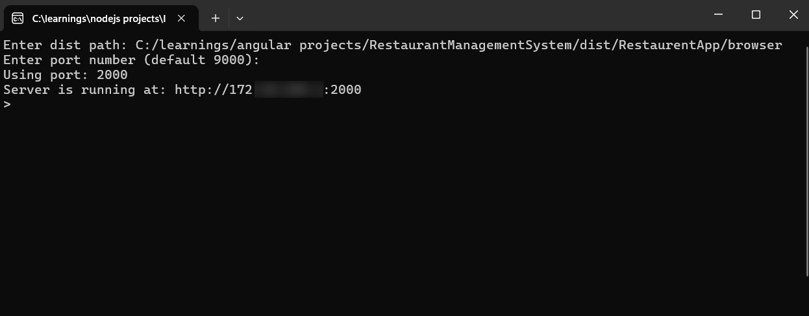
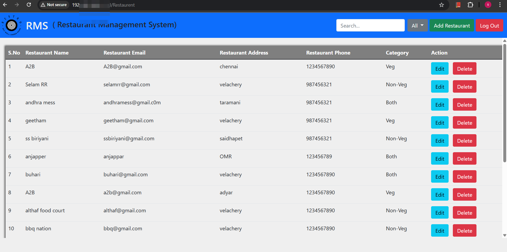
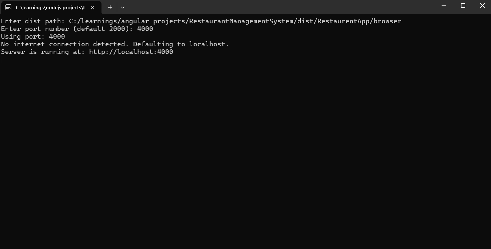
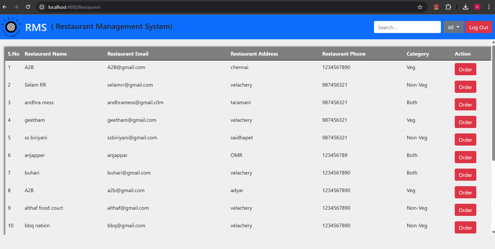

# launchpad
To test the application in the cloud, deployment and testing can be time-consuming. However, there is a solution to deploy the application locally, allowing for instant testing.

## Features
- Serves files  in dist from a user-specified directory.
- Allows the user to choose a port (default: 2000).
- Displays the local network IP address for easy access.
- If not connected in any of the network if hosted in localhost or 127.0.0.1
- It prompts the user for a directory path and a port number, then serves   files from the specified directory.
## Requirements
- Node.js (latest version recommended)
- Express.js

## Installation
1. Install [Node.js](https://nodejs.org/)
2. Install dependencies:

   ```
   npm install express
   ```
## Working
### Running the Application Locally and on Other Systems
#### Running Locally (on Your System)
- When you start your application, it is accessible via `localhost` (which refers to your own machine).
- Open a browser and enter:  http://localhost:<frontend-port> to access the frontend.
- Your backend also runs on `localhost`, typically on a different port:  
http://localhost:<backend-port>


#### Accessing from Other Systems (Same Network)
- If your system has a local network IP (e.g., `192.xxx.x.xx`), other devices in the same network can access your application.
- Instead of `localhost`, use your system's 
IP address:http://192.xxx.x.xx:<frontend-port>for the frontend, and  http://192.xxx.x.xx:<backend-port>for the backend.
- This works because both the frontend and backend are running on the same IP but different ports.

### Summary

| Environment              | URL Example                 |
|--------------------------|-----------------------------|
| Local System (Frontend)  | `http://localhost:3000`     |
| Local System (Backend)   | `http://localhost:5000`     |
| Other Systems (Frontend) | `http://192.xxx.x.xx:3000` |
| Other Systems (Backend)  | `http://192.xxx.x.xx:5000` |

This setup allows others on the same network to use your application without running it on their own machines.
  
 ## Screen Shots
After started the script 
#### Connected to network


#### Not connected to the network



** ## Note**
- This script requires administrative privileges to function correctly, especially when accessing remote computers or systems.
- Granting administrative access is necessary for this script to execute successfully on other computers or systems.
